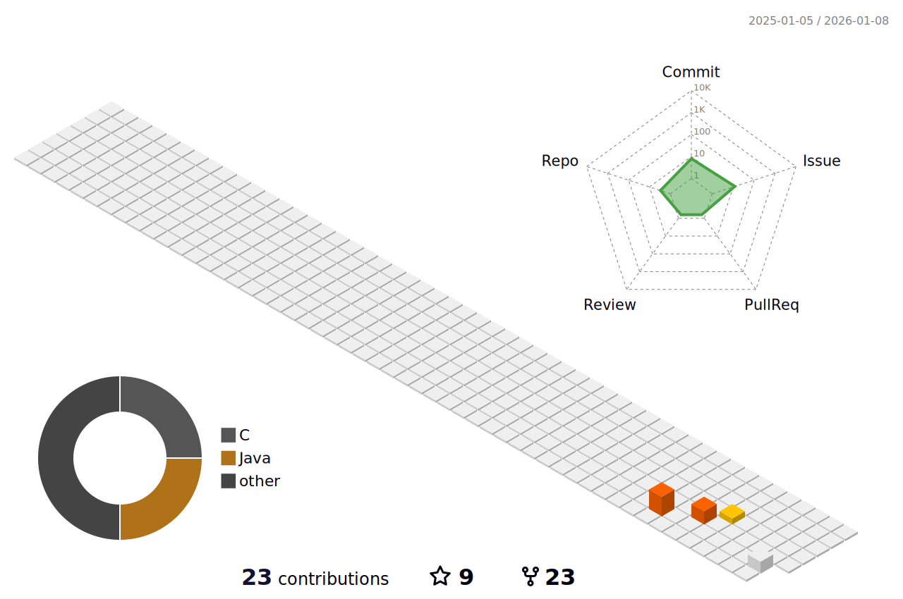

# Hi there 👋

Hi! I am ✨ Akshay Chipkar ✨, a C++ developer with over 11 years of experience. My journey in open source began with FOSSEE, where I contributed for nearly six years, working on various projects under their main initiative. I have assisted several organizations in achieving their goals through C++ projects, consistently delivering within set timeframes.

My expertise spans multiple domains, including retail chains, industrial automation, and avionics. I excel in both desktop and embedded software development. Additionally, I have experience in resolving cross-functional issues through effective collaboration and participating in board bring-up activities, working with diverse C++ development toolchains.

I have developed automated test scripts using frameworks like Catch2 and the Trompeloeil mocking framework. I have also modified a large codebase to comply with coding standards, ensuring cross-platform compatibility for the software.

Alongside C++, I have extensively used Python to create applications, test frameworks, and test cases. I am familiar with UI and web libraries such as Tkinter, Django, and Flask, which further enhance my development capabilities.

## 📫 Socials:
   

# 💻 Tech Stack:
                          

## 📚️ Skills and Technologies

**C++ Expertise:** Proficient in writing high-quality applications.

**Scripting:** Experienced with Docker, CMake, Automake, Shell, Batch, and PowerShell scripts.

**Testing Contributions:** Developed automated test scripts using Catch2 and the Trompeloeil mocking framework.

**Python:** Extensively used for creating applications, test frameworks, and test cases.

**UI/Web Development:** Familiar with libraries such as Qt, Gtk, Wt, Tkinter, Django, and Flask.

**Hardware Communication:** Worked extensively with protocols like I2C, UART, Bluetooth Low Energy, and CAN for avionics.

## 🛐️ Projects

- **FOSSEE**: Contributed to the **[OpenPLC-ldmicro](https://github.com/FOSSEE/OpenPLC-ldmicro)** project by adding Arduino-compatible builds and implementing CAD simulations at **[LDmicro](https://github.com/akshay-c/LDmicro)**. I ported the original Windows software to Linux, enhancing accessibility through the **[LDMicroGtk](https://github.com/FOSSEE/LDMicroGtk)** and **[LDmicroQt](https://github.com/FOSSEE/LDmicroQt)** projects. The hardware components were also uploaded to the **[OpenPLC](https://github.com/FOSSEE/OpenPLC)** repository.

- **Cognizant**: Updated legacy socket-based code to utilize TCP socket communication with the **Pistachio** library for HTTPS. Primarily focused on a retail client’s software, I managed communication between POS devices and servers, implementing manual testing, Docker-based builds, and Automake scripts.

- **LTTS**: Employed **Lint** for static analysis on the existing codebase, actively identifying and fixing issues while updating the software. My responsibilities later transitioned to writing unit tests to ensure code coverage, along with refining hardware-in-loop tests and the UI to support new features.

- **Boeing**: Initially worked on a custom tool that utilized C# and Python for testing C++ code within an avionics project using the **Deos** RTOS. This role involved configuring RTOS, porting applications, and creating a testing framework. Additionally, I contributed to the development of embedded Linux applications, including writing a device driver for a power monitoring IC and converting Python applications to C++ for enhanced performance and safety. My role expanded to include board bring-up activities, focusing on device tree configuration and resolving communication issues through cross-functional collaboration.

# 📊 GitHub Stats:

